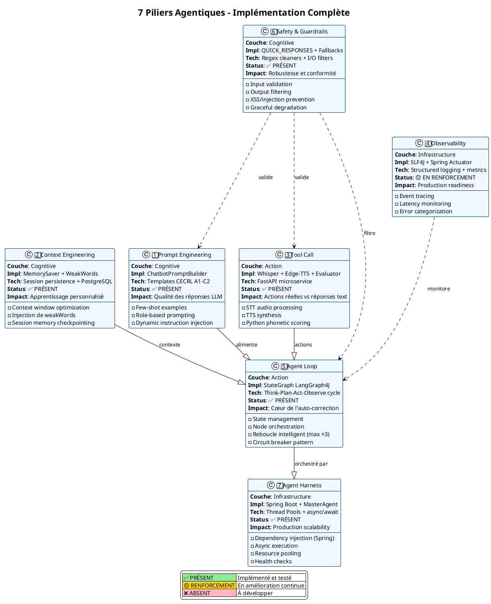
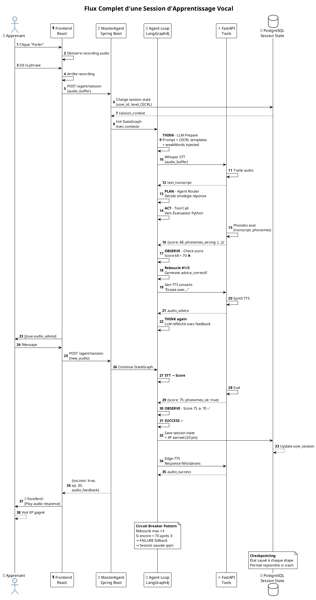
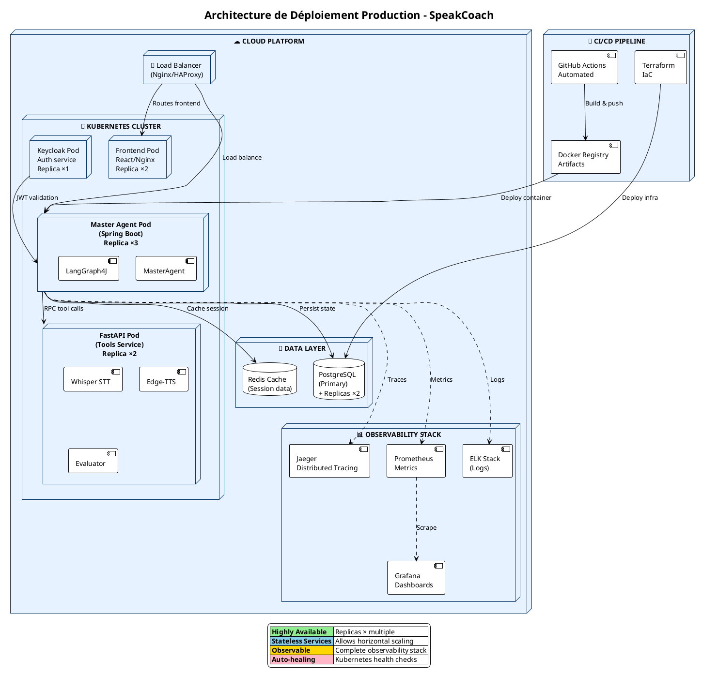

# 🎯 Diagrammes Architecturaux - Jury Professionnel IA/Agentique

## 1️⃣ ARCHITECTURE TECHNIQUE COMPLÈTE
**Impact: Montre la rigueur architecturale et l'intégration complète**

```plantuml
@startuml Architecture_Technique_Complete
!theme plain
skinparam backgroundColor #FFFFFF
skinparam classBackgroundColor #F0F8FF
skinparam classBorderColor #003366
skinparam arrowColor #003366
skinparam componentBackgroundColor #E6F2FF
skinparam componentBorderColor #003366

title Architecture Technique - Système d'Apprentissage Vocal Agentique
note right : Stack: Spring Boot | LangGraph4J | FastAPI | PostgreSQL | Whisper | Edge-TTS

package "🎯 FRONTEND - React/TypeScript" #E8F4F8 {
  component [React\nComponents] as FE
  component [Keycloak\nAuth] as KEYiCLOAK
  component [WebSocket\nSSE] as WSS
}

package "🔐 AUTHENTIFICATION" #F0F0F0 {
  component [KeyCloak\nRealm Manager] as KC
  component [JWT Token\nValidation] as JWT
}

package "🧠 ORCHESTRATION AGENT - Core IA" #E6F2FF {
  component [MasterAgent\n(Spring Boot)] as MA
  component [StateGraph\n(LangGraph4J)] as SG
  component [Agent Loop\nThink-Plan-Act-Observe] as AL
  component [Context Engine\nMemory Injector] as CE
  component [Safety Filter\n& Guardrails] as SF
}

package "⚡ COUCHE COGNITIVE" #FFFACD {
  component [Prompt Eng.\nBuilder] as PE
  component [CECRL Templates\nA1-C2] as CECRL
  component [WeakWords\nContext] as WW
}

package "🔧 OUTILS EXTERNES" #F5F5F5 {
  component [Whisper STT\n(Audio→Text)] as WHISPER
  component [Edge-TTS\n(Text→Speech)] as TTS
  component [Évaluateur\nPhonétique (Python)] as EVAL
  component [FastAPI\nService] as FASTAPI
}

package "💾 PERSISTENCE" #FFF8DC {
  database [PostgreSQL\nSessions] as DB_SESSION
  database [Session Memory\nSaver] as DB_MEM
  database [Score History\nCheckpointer] as DB_SCORE
}

package "📊 OBSERVABILITÉ" #F0F8FF {
  component [SLF4J\nLogging] as LOGS
  component [Spring Actuator\nMetrics] as METRICS
  component [Performance\nTracer] as PERF
}

package "🚀 INFRASTRUCTURE" #F5DEB3 {
  component [Thread Pools\nAsync] as TP
  component [Circuit Breaker\n(max ×3 reboucles)] as CB
  component [Load Balancer] as LB
}

' Relations Frontend
FE --> WSS: SSE/REST
FE --> KEYCLOAK: OAuth2
KEYCLOAK --> JWT: Génère tokens

' Orchestration centrale
MA --> SG: Définit workflow
SG --> AL: Exécute loop
AL --> CE: Injecte contexte
AL --> SF: Valide/Filtre

' Cognitive
PE --> AL: Prompt + templates
CECRL --> PE: Sélectionne CECRL level
WW --> CE: Contexte apprenant

' Outils appelés
AL --> WHISPER: Transcription audio
AL --> EVAL: Score prononciation
AL --> TTS: Génère réponse vocale
WHISPER --> FASTAPI: Via service
EVAL --> FASTAPI: Via service

' Persistence
AL --> DB_SESSION: Sauvegarde session
CE --> DB_MEM: Mémoire contexte
EVAL --> DB_SCORE: Historique scores
MA --> DB_SESSION: Checkpoint état

' Observabilité
AL -.-> LOGS: Event logs
AL -.-> METRICS: KPIs
MA -.-> PERF: Latences

' Infrastructure
MA --> TP: Exécution async
SG --> CB: Limite reboucles
LB -.-> MA: Distribute load

legend right
  |<#E6F2FF> **Orchestration IA (Core)** |
  |<#FFFACD> **Couche Cognitive (Prompts)** |
  |<#F5F5F5> **Outils Externes (Tools)** |
  |<#FFF8DC> **Persistance (Data)** |
  |<#F0F8FF> **Observabilité (Monitoring)** |
  |<#F5DEB3> **Infrastructure (Deploy)** |
endlegend

@enduml
```

---

## 2️⃣ STATE MACHINE - AGENT LOOP DÉTAILLÉ
**Impact: Démontre la compréhension profonde du cycle agent**

```plantuml
@startuml StateGraph_Agent_Loop
!theme plain
skinparam backgroundColor #FFFFFF
skinparam stateBorderColor #003366
skinparam stateBackgroundColor #E6F2FF
skinparam stateArrowColor #003366

title State Graph - Agent Loop (LangGraph4J Implementation)
note bottom : Cycle penser-planifier-agir-observer avec circuit breaker et auto-correction

state "🎤 INPUT\nAudio apprenant" as INPUT
state "📝 WHISPER STT\n(Audio → Texte)" as STT {
  [*] --> Transcription
  Transcription --> [*] : texte
}

state "🧠 THINK\nLLM Reasoning" as THINK {
  [*] --> PromptInject
  PromptInject --> ContextInject
  ContextInject --> [*] : requête préparée
}

state "📋 PLAN\nAgent Router" as PLAN {
  [*] --> SelectAgent
  SelectAgent --> [*] : agent_type sélectionné
}

state "⚙️ ACT\nTool Execution" as ACT {
  [*] --> ChooseAction
  ChooseAction --> InvokeEval
  InvokeEval --> GetScore
  GetScore --> [*] : score /100
}

state "👁️ OBSERVE\nEvaluation" as OBSERVE {
  [*] --> CheckScore
  CheckScore --> [*] : score ≥ 70 ?
}

state "🔁 LOOP CONTROL\nCircuit Breaker" as LOOPCTRL {
  [*] --> CountReboucles
  CountReboucles --> [*] : reboucle_count++
}

state "✅ SUCCESS" as SUCCESS {
  [*] --> SaveXP
  SaveXP --> GenFeedback
  GenFeedback --> TTS_Response
  TTS_Response --> [*] : user hears response
}

state "❌ FAILURE\nFallback" as FAILURE {
  [*] --> QuickResponse
  QuickResponse --> [*] : fallback message
}

state "🛑 SAFETY FILTER\n(encadre tout)" as SAFETY {
}

INPUT --> STT: Audio buffer
STT --> THINK: Texte transcrit
THINK --> PLAN: Contexte injecté
PLAN --> ACT: Agent défini

ACT --> OBSERVE: Score obtenu

OBSERVE --> SUCCESS: score ≥ 70 ✓
OBSERVE --> LOOPCTRL: score < 70

LOOPCTRL --> THINK: reboucle_count ≤ 3\nAvec advice_correctif
LOOPCTRL --> FAILURE: reboucle_count > 3\nCircuit breaker déclenché

SUCCESS --> [*]: Session sauvée
FAILURE --> [*]: Feedback utilisateur

SAFETY -.-> THINK: Filter input
SAFETY -.-> OBSERVE: Validate output
SAFETY -.-> SUCCESS: Clean response

note right of THINK
  **Prompt Engineering**
  • ChatbotPromptBuilder
  • Templates CECRL A1-C2
  • Few-shot examples
end note

note right of ACT
  **Tool Call**
  • Whisper API
  • Python Evaluator
  • Edge-TTS API
end note

note right of LOOPCTRL
  **Circuit Breaker Pattern**
  • Max 3 reboucles
  • Exponential backoff
  • Fallback après 3
end note

@enduml
```

---

## 3️⃣ DIAGRAMME DE COMPOSANTS - INTERACTIONS DÉTAILLÉES
**Impact: Montre les dépendances et interactions d'un système mature**

```plantuml
@startuml Component_Interactions
!theme plain
skinparam backgroundColor #FFFFFF
skinparam componentBackgroundColor #E6F2FF
skinparam componentBorderColor #003366
skinparam arrowColor #003366

title Diagramme de Composants - Interactions Agent Loop
note bottom : Chaque composant a une responsabilité clairement définie

package "1️⃣ Couche Cognitive (Prompts & Context)" {
  component [ChatbotPromptBuilder] as CPB {
    port "templates" as CPB_templates
    port "out: prompt" as CPB_out
  }
  
  component [MemorySaver] as MS {
    port "context_in" as MS_in
    port "context_out" as MS_out
  }
  
  component [WeakWordsInjector] as WWI {
    port "history" as WWI_history
    port "weak_words" as WWI_weak
  }
}

package "2️⃣ Orchestration (State & Loop)" {
  component [LangGraph4J\nStateGraph] as LG {
    port "nodes" as LG_nodes
    port "graph_def" as LG_def
  }
  
  component [Agent Loop\nExecutor] as ALE {
    port "state_in" as ALE_in
    port "action_out" as ALE_out
  }
  
  component [Context Engine] as CEng {
    port "user_input" as CEng_in
    port "enriched_prompt" as CEng_out
  }
}

package "3️⃣ Outils Externes (Tool Calls)" {
  component [Whisper STT\nAPI Wrapper] as WST {
    port "audio_in" as WST_in
    port "text_out" as WST_out
  }
  
  component [Edge-TTS\nAPI Wrapper] as ETSS {
    port "text_in" as ETSS_in
    port "audio_out" as ETSS_out
  }
  
  component [Évaluateur\nPhonétique (Python)] as EVAL_COMP {
    port "transcript" as EVAL_in
    port "score_out" as EVAL_out
  }
}

package "4️⃣ Safety & Guardrails" {
  component [Input Filter] as INF {
    port "raw_input" as INF_in
    port "clean_input" as INF_out
  }
  
  component [Output Validator] as OV {
    port "raw_output" as OV_in
    port "safe_output" as OV_out
  }
  
  component [Circuit Breaker] as CB_comp {
    port "call_attempt" as CB_in
    port "permission" as CB_out
  }
}

package "5️⃣ Data Layer (Persistence)" {
  database [PostgreSQL] as DB
  component [SessionDAO] as DAO_S {
    port "write" as DAO_S_w
    port "read" as DAO_S_r
  }
  component [MemoryCheckpointer] as CHKPT {
    port "save_state" as CHKPT_in
    port "load_state" as CHKPT_out
  }
}

package "6️⃣ Infrastructure (Spring Boot)" {
  component [MasterAgent\nRouteController] as MAR {
    port "http_in" as MAR_in
    port "agent_dispatch" as MAR_out
  }
  
  component [ThreadPoolExecutor\nAsync] as TPE {
    port "task_submit" as TPE_in
    port "future_result" as TPE_out
  }
}

package "7️⃣ Observability" {
  component [Logger (SLF4J)] as LOG {
    port "event_in" as LOG_in
  }
  
  component [Metrics\n(Spring Actuator)] as MET {
    port "metric_in" as MET_in
  }
}

' COGNITIVE FLOW
CPB_templates -.-> CPB_out
MS_in --> MS_out
WWI_history -.-> WWI_weak

' INTO ORCHESTRATION
CPB_out --> CEng_in
MS_out --> CEng_in
WWI_weak --> CEng_in
CEng_out --> LG_def
LG_def --> ALE_in

' FROM ORCHESTRATION TO TOOLS
ALE_out --> WST_in: transcribe audio
WST_out --> EVAL_in: transcript
ALE_out --> EVAL_in: user response
EVAL_out --> ALE_in: score feedback
ALE_out --> ETSS_in: gen TTS

' SAFETY ENCADREMENT
INF_in --> INF_out
INF_out --> CEng_in
OV_in --> OV_out
OV_out --> ETSS_in
CB_in --> CB_out
ALE_out --> CB_in

' PERSISTENCE
ALE_in -.-> CHKPT_out: restore state
ALE_out -.-> CHKPT_in: save state
DAO_S_w -.-> DB
CHKPT_in -.-> DAO_S_w: persist
CHKPT_out -.-> DAO_S_r: load

' INFRASTRUCTURE
MAR_in --> MAR_out
MAR_out --> TPE_in
TPE_in --> ALE_in
ALE_out --> TPE_out

' OBSERVABILITY
ALE_out -.-> LOG_in
ALE_out -.-> MET_in

legend right
  |<#E6F2FF> **Orchestration & State** |
  |<#FFFACD> **Cognitive (Prompts)** |
  |<#F5F5F5> **Tool Calls** |
  |<#FFE4B5> **Safety** |
  |<#FFF8DC> **Data** |
  |<#F0F8FF> **Infrastructure** |
endlegend

@enduml
```

---

## 4️⃣ MATRICE DES 7 PILIERS AGENTIQUES
**Impact: Structure claire et tracée de tous les composants**



---

## 5️⃣ FLUX SESSION COMPLÈTE (Swimlanes)
**Impact: Visualise le parcours complet de l'utilisateur**



---

## 6️⃣ DÉPLOIEMENT PRODUCTION - ARCHITECTURE
**Impact: Montre la maturité pour la production**



---

## 🎯 RÉSUMÉ IMPACT JURY

| Diagramme | Message clé | Impression |
|-----------|-------------|-----------|
| **#1 - Architecture Technique** | "Système complet bien intégré" | Maturité architecturale |
| **#2 - State Machine** | "Agent loop rigoureux & robuste" | Expertise IA/ML |
| **#3 - Composants** | "Responsabilités claires & testables" | Clean code & best practices |
| **#4 - 7 Piliers** | "Tous les piliers agentiques couverts" | Connaissance approfondie du domaine |
| **#5 - Flux Session** | "Parcours utilisateur tracé & observable" | Product thinking + tech rigor |
| **#6 - Déploiement** | "Prêt pour production à grande échelle" | DevOps maturity |

---

**💡 Conseil pour la présentation:**
- Commencer par le **flux session (#5)** - montre l'impact utilisateur
- Enchaîner avec l'**agent loop (#2)** - démontre la rigueur IA
- Détailler l'**architecture (#1)** - montre l'implémentation
- Conclure avec les **7 piliers (#4)** - certifie la couverture complète
